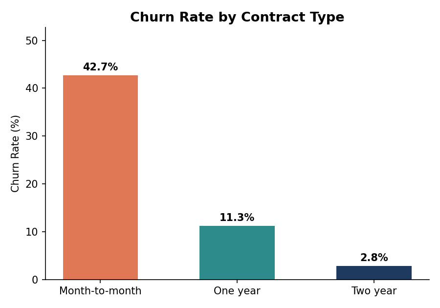
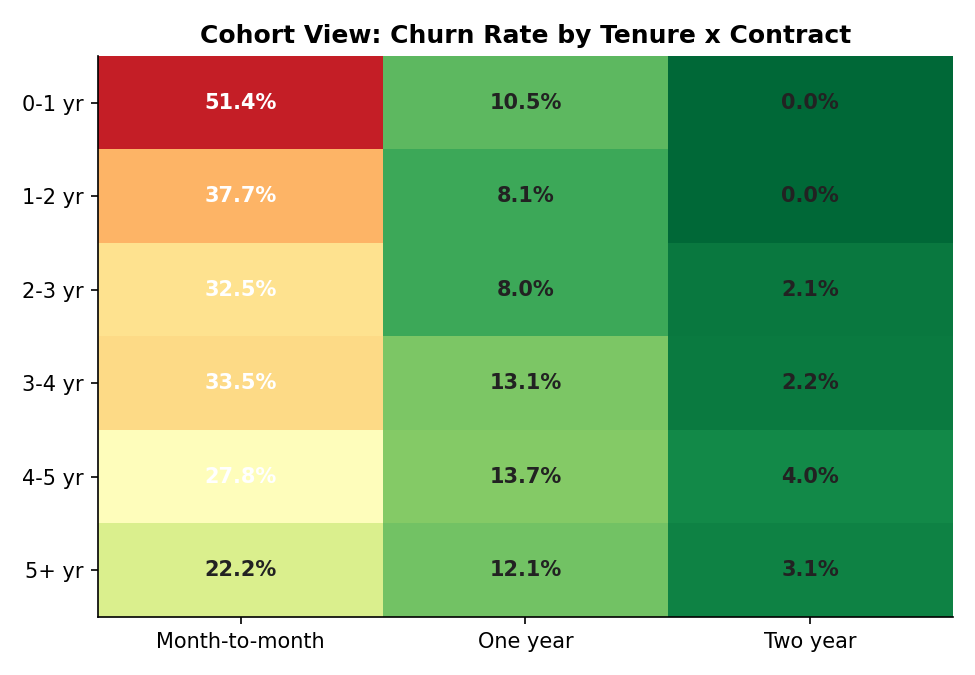

# Customer Retention & Churn Analysis

Analysis of the Telco Customer Churn dataset (7,043 customers) to identify why 
customers leave and what actions could reduce churn.

## 📊 Key Findings
- Overall churn rate: **26.5%**, representing ~30% of monthly recurring revenue at risk
- Month-to-month customers churn at **43%** vs just **3%** for two-year contracts
- Fiber-optic customers churn at **42%** despite being the premium product
- Electronic check payers churn **3x more** than automatic-payment customers
- Churn is front-loaded: **47%** of first-year customers leave within their first year

## 🛠️ Tools Used
- Python (pandas, matplotlib) for data cleaning and analysis
- Excel for the interactive dashboard

## 📁 What's in this repo
- `dashboard/` — Excel dashboard with live formulas and charts
- `charts/` — exported chart images
- `report/` — full written analysis report
- `data/` — raw and cleaned datasets

## 📈 Sample Visuals

## 💡 Recommendations
1. Convert month-to-month customers to annual contracts
2. Improve first-year onboarding experience
3. Investigate fiber-optic service quality and pricing
4. Migrate customers off electronic check to autopay
5. Bundle protective add-on services
